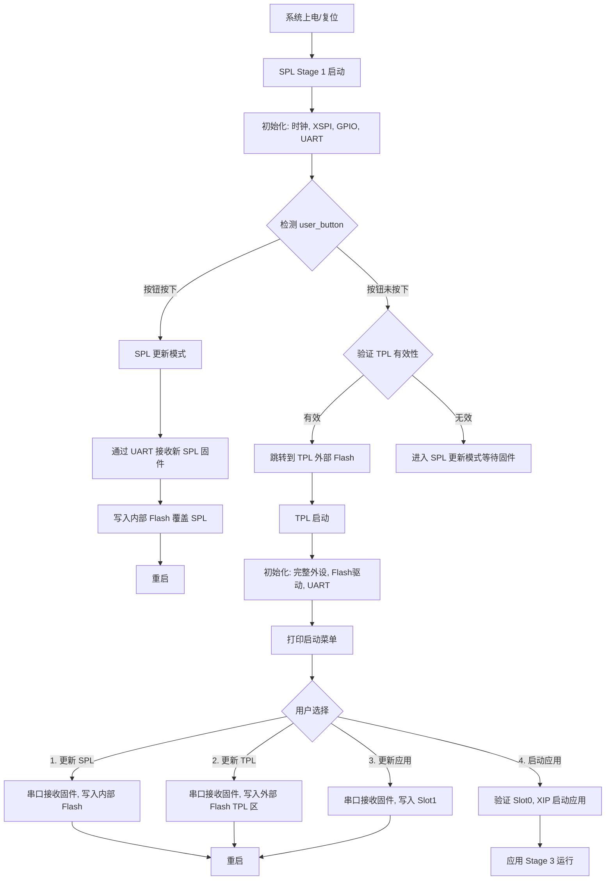

# ART-Pi2 Bootloader

基于 Zephyr RTOS 的 ART-Pi2 开发板（STM32H7R7xx）三段式引导 Bootloader 系统。

## 概述

本项目为 ART-Pi2 开发板实现了一个**三段式引导**的 bootloader 系统，分为三个引导阶段：

| 阶段 | 名称 | 位置 | 大小 | 功能 |
|------|------|------|------|------|
| Stage 1 | **SPL** (Secondary Program Loader) | 内部 Flash (0x08000000) | 64KB | 最简初始化，检测按钮，跳转 TPL 或进入更新模式 |
| Stage 2 | **TPL** (Tertiary Program Loader) | 外部 Flash (0x70000000) | 256KB | 菜单交互，更新 SPL/自身/应用，引导应用 |
| Stage 3 | **应用** (Application) | 外部 Flash Slot0 (0x70040000) | 1MB | 用户应用程序 |

## 硬件平台

| 项目 | 描述 |
|------|------|
| MCU | STM32H7R7xx (Cortex-M7, 300MHz) |
| 内部 Flash | 64KB (0x08000000) - 存放 SPL |
| 外部 Flash | XSPI2 接口连接 512MB NOR Flash (0x70000000 Memory Map) |
| UART 控制台 | uart4 (PD1 TX, PD0 RX, 115200bps) |
| 用户按钮 | user_button (GPIOC13, 低电平有效) |
| LED | red_led (GPIOO1), blue_led (GPIOO5) |

## Flash 分区布局

```
内部 Flash (64KB @ 0x08000000):
+---------------------------+ 0x08000000
| SPL (Stage 1)             | 64KB
+---------------------------+ 0x0800FFFF

外部 Flash (512MB @ 0x70000000, Memory Map):
+---------------------------+ 0x70000000
| TPL (Stage 2)             | 256KB
+---------------------------+ 0x70040000
| Slot0 (应用 - Stage 3)    | 1MB
+---------------------------+ 0x70140000
| Slot1 (升级暂存区)        | 1MB
+---------------------------+ 0x70240000
| Storage (配置/状态)       | 8KB
+---------------------------+ 0x70242000
| (剩余空间)                | ~509MB
+---------------------------+ 0x72000000
```

## 系统架构

### 三段式引导流程



### 各阶段职责

#### Stage 1 - SPL（内部 Flash）

SPL 是最小化的引导程序，职责：
1. **最小化硬件初始化**
   - 配置系统时钟（HSE+PLL，300MHz）
   - 初始化 XSPI2 控制器（使能 Memory Map 模式）
   - 初始化 UART4（115200bps）
   - 初始化 GPIO（按钮、LED）
2. **按钮检测**
   - 检测 `user_button`（GPIOC13）状态
   - 按下 → 进入 SPL 更新模式
   - 未按下 → 验证并跳转到 TPL
3. **SPL 自更新模式**
   - 通过 UART 接收新 SPL 固件（YModem 协议）
   - 擦写内部 Flash（0x08000000）
   - 写入新固件后重启
4. **跳转到 TPL**
   - 验证外部 Flash 中 TPL 的起始标志（Magic Number）
   - 配置 VTOR 到外部 Flash 地址
   - 跳转到 TPL 入口

> **SPL 必须保持极小体积**（< 64KB），使用 minimal libc，仅包含必要驱动。

#### Stage 2 - TPL（外部 Flash）

TPL 是功能完整的引导程序，职责：
1. **完整硬件初始化**
   - 重新初始化所有外设
   - 初始化内部 Flash 驱动（用于更新 SPL）
   - 初始化外部 Flash 驱动（XSPI）
2. **串口菜单交互**
   - 通过 UART 打印交互菜单
   - 等待用户输入选择（3 秒超时自动启动应用）
3. **菜单选项**
   - **选项 1：更新 SPL（Stage 1）** — 通过串口接收新 SPL 固件，擦写内部 Flash 0x08000000，重启
   - **选项 2：更新 TPL（自身）** — 通过串口接收新 TPL 固件，写入外部 Flash TPL 分区，重启
   - **选项 3：更新应用（Stage 3）** — 通过串口接收新应用固件，写入 Slot1，标记升级请求，重启
   - **选项 4：启动应用** — 验证 Slot0 镜像有效性，配置 XSPI Memory Map，跳转到应用入口

#### Stage 3 - 应用（外部 Flash）

用户的实际应用程序，由 TPL 引导启动。应用固件通过 TPL 的更新功能烧录到 Slot0 分区。

## 目录结构

```
art_pi2_bootloader/
├── common/                    # 公共模块
│   ├── firmware_header.h      # 固件头定义
│   ├── firmware_loader.c      # 固件加载器
│   ├── firmware_loader.h
│   ├── fw_header.c            # 固件头操作
│   ├── ymodem.c               # YModem 协议实现
│   └── ymodem.h
├── spl/                       # SPL (Stage 1)
│   ├── CMakeLists.txt         # SPL 构建配置
│   ├── prj.conf               # SPL 最小配置
│   ├── app.overlay            # 应用设备树 overlay
│   ├── boards/
│   │   └── art_pi2.overlay    # 分区定义
│   └── src/
│       ├── main.c             # SPL 主程序
│       ├── flash_helper.c     # 内部 Flash 操作
│       ├── flash_helper.h
│       ├── menu.c             # 菜单交互
│       └── menu.h
├── tpl/                       # TPL (Stage 2)
│   ├── CMakeLists.txt         # TPL 构建配置
│   ├── prj.conf               # TPL 配置
│   ├── boards/
│   │   └── art_pi2.overlay    # TPL 设备树
│   ├── scripts/
│   │   └── gen_tpl_fw.sh      # TPL 固件生成脚本
│   └── src/
│       ├── main.c             # TPL 主程序
│       ├── flash_helper.c     # Flash 操作
│       ├── flash_helper.h
│       ├── menu.c             # 菜单交互
│       ├── menu.h
│       ├── update_spl.c       # SPL 更新逻辑
│       ├── update_tpl.c       # TPL 自更新逻辑
│       └── update_app.c       # 应用更新逻辑
├── linker/
│   └── fw_header.ld           # 链接脚本 - 固件头
├── tools/
│   ├── fw_patch.py            # 固件补丁工具
│   └── fw_summary.py          # 固件摘要工具
├── LICENSE
├── .gitignore
└── README.md                  # 本文件
```

## 构建和烧录

### 环境要求

- Zephyr RTOS（west 构建系统）
- ARM GCC 交叉编译工具链
- ART-Pi2 开发板

### 构建 SPL

```bash
cd art_pi2_bootloader/spl
west build -b art_pi2/stm32h7r7xx -d build
```

### 构建 TPL

```bash
cd art_pi2_bootloader/tpl
west build -b art_pi2/stm32h7r7xx -d build
```

### 烧录 SPL 到内部 Flash

```bash
west flash -d spl/build
```

### 烧录 TPL 到外部 Flash

- 通过 SPL 的更新模式烧录（按住 user_button 上电，通过串口 YModem 发送 TPL 固件）
- 或使用调试器直接烧录到外部 Flash 地址 0x70000000

## 串口更新协议

使用 **YModem 协议** 进行固件传输：

- 成熟稳定，广泛使用
- 支持文件传输，有 CRC16 校验
- 主机端工具丰富（TeraTerm, SecureCRT, lrzsz 等）
- SPL 和 TPL 均使用 YModem 协议

### 更新流程

1. **更新 SPL**：按住 user_button 上电 → SPL 进入更新模式 → 主机通过串口发送 SPL 固件
2. **更新 TPL**：正常启动进入 TPL 菜单 → 选择选项 2 → 主机通过串口发送 TPL 固件
3. **更新应用**：正常启动进入 TPL 菜单 → 选择选项 3 → 主机通过串口发送应用固件
4. **启动应用**：正常启动进入 TPL 菜单 → 选择选项 4（或等待 3 秒超时自动启动）

## 关键设计要点

### SPL 体积控制
- SPL 必须 < 64KB（内部 Flash 大小限制）
- 使用 `CONFIG_MINIMAL_LIBC` 减小体积
- 仅包含必要驱动（UART, GPIO, 时钟）
- YModem 实现需精简

### 外部 Flash XIP 启动
- SPL 需要初始化 XSPI2 并配置 Memory Map 模式
- TPL 和应用都运行在外部 Flash 的 Memory Map 地址空间
- 跳转前需要确保 XSPI 控制器处于 Memory Map 状态

### 固件更新安全
- **SPL 自更新**：由 TPL 执行，擦写内部 Flash 的 SPL 区域，写入完成后验证 Magic Number
- **TPL 自更新**：新固件写入外部 Flash TPL 分区，重启后由 SPL 加载新 TPL
- **应用更新**：新固件写入 Slot1，重启后由 TPL 将 Slot1 内容复制到 Slot0 或交换分区指针

### 跳转逻辑
- 跳转前关闭全局中断和 SysTick
- 设置 VTOR 到目标地址
- 加载目标地址的栈指针（MSP）和入口地址
- 跳转到入口执行

## 许可证

本项目基于 Zephyr RTOS 项目，遵循其开源许可证。
